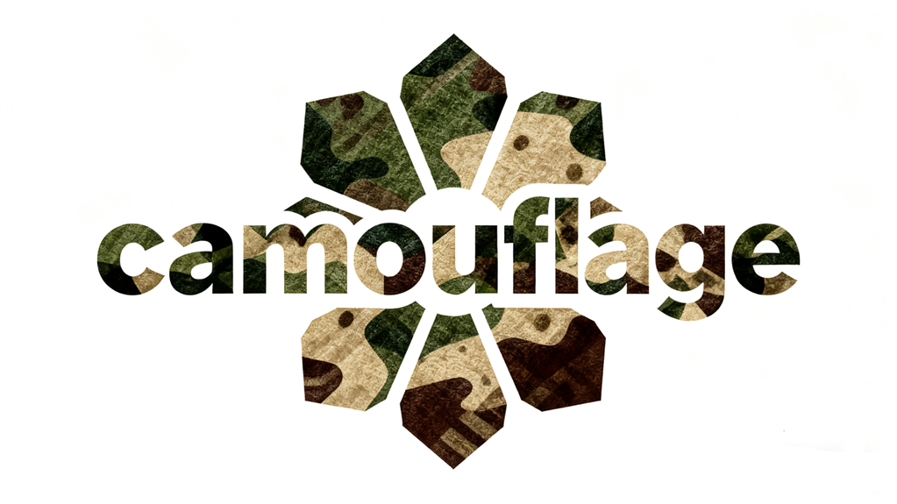

      

    
    
    

# 
`Awesome List for Camouflaged Object Detection (COD)`

:loudspeaker:<strong>Last updated: 2025.09.30</strong>

- [09/2025] Update with ACMMM2025 and latest papers. 
- [06/2025] Update with ICCV2025 papers.    
- [06/2025] Update with CVPR2025, AAAI2025 papers.    

---

:teddy_bear: We mark different tasks with coloured squares:

<table>
    <tr>
        <td style="width: 20%;">:blue_square:<code>COD</code></td>
        <td style="width: 20%;">Camouflaged Object Detection</td>
        <td style="width: 20%;">:orange_square:<code>COS</code></td>
        <td style="width: 20%;">Camouflaged Object Segmentation</td>
    </tr>
    <tr>
        <td style="width: 20%;">:green_square:<code>CG</code></td>
        <td style="width: 20%;">Camouflage Generation</td>
        <td style="width: 20%;">:red_square:<code>VCOD</code></td>
        <td style="width: 20%;">Video Camouflaged Object Detection</td>
    </tr>
    <tr>
        <td style="width: 20%;">:purple_square:<code>COT</code></td>
        <td style="width: 20%;">Camouflaged Object Tracking</td>
        <td style="width: 20%;">:white_large_square:<code>CX</code></td>
        <td style="width: 20%;">Other types of Camouflage Task</td>
    </tr>
</table>

---

<!--TOC-->

## 📚 Table of Contents:
<!-- - [Overview](#Overview) -->
<table style="margin-left: auto; margin-right: auto;">
    <tr>
        <td> <!--左侧内容-->
            <ul>
                <li><a href="#1-Latest">1. Latest Work</a></li>
                <li><a href="#2-Survey-Papers">2. Survey Papers</a></li>
                <li><a href="#3-Image-Camouflage-Detection">3. Image Camouflage Detection</a>
                    <ul>
                        <li><a href="#31-COD">3.1. Camouflaged Object Detection (COD)</a></li>
                        <li><a href="#32-Semi-supervised-COD">3.2. Semi-supervised COD</a></li>
                        <li><a href="#33-Weakly-supervised-COD">3.3. Weakly-supervised COD</a></li>
                        <li><a href="#34-Unsupervised-COD">3.4. Unsupervised COD</a></li>
                        <li><a href="#35-Referring-COD">3.5. Referring COD</a></li>
                        <li><a href="#36-Zero-Shot-COD">3.6. Zero-Shot COD</a></li>
                        <li><a href="#37-Multispectral-COD">3.7. Multispectral COD</a></li>
                        <li><a href="#38-Polarized-COD">3.8. Polarized COD</a></li>
                    </ul>
                </li>
            </ul>
        </td>
        <td> <!--右侧内容-->
            <ul>
                <li><a href="#4-Video-Camouflage-Detection">4. Video Camouflage Detection</a>
                    <ul>
                         <li><a href="#41-Video-Camouflaged-Object-Detection">4.1. Video Camouflaged Object Detection (VCOD)</a></li>
                    </ul>
                </li>
                <li><a href="#5-Camouflage-Segmentation">5. Camouflage Segmentation</a>
                    <ul>
                        <li><a href="#51-Camouflage-Object-Segmentation">5.1. Camouflage Object Segmentation (COS)</a>
                        <li><a href="#52-Camouflaged-Instance-Segmentation">5.2. Camouflaged Instance Segmentation (CIS)</a></li>
                        <li><a href="#53-Open-Vocabulary-COS">5.3. Open-Vocabulary COS</a></li>
                    </ul>
                </li>
                <li><a href="#6-Camouflage-Generation">6. Camouflage Generation</a></li>
                <li><a href="#7-Camouflage-Tracking">7. Camouflage Tracking</a></li>
                <li><a href="#8-Other-Related">8. Other Related</a></li>
                <li><a href="#Datasets">Datasets</a></li>
                <li><a href="#Reference">Reference</a></li>
            </ul>
        </td>
    </tr>
</table>

----------------------------------------------------------------------------------------------------------------------

<h2 id="1-Latest">
    :fire: 1. Latest Work (Last 6 months)
</h2>

| **Task** | **Release** |**Pub.** | **Title** | **Links** |
| :------: | :---------: | :-----: | :-------: | :-------: |
|:white_large_square: `XCOD` | `2023/Mar` | `Arxiv` | Explicit Visual Prompting for Universal Foreground Segmentations   *Weihuang Liu, Xi Shen, Chi-Man Pun, Xiaodong Cun* | [Paper](https://arxiv.org/abs/2305.18476) / [Code](https://github.com/NiFangBaAGe/Explicit-Visual-Prompt) |

----------------------------------------------------------------------------------------------------------------------

    

        <h2 id="2-Survey-Papers">
            2. Survey Papers
        </h2>
    

----------------------------------------------------------------------------------------------------------------------

<!--Image Camouflage Detection-->

    
<h2 id="3-Image-Camouflage-Detection">3. Image Camouflage Detection</h2>

    
<h3 id="31-COD">3.1. Camouflaged Object Detection</h3>

| **Year** | **Pub.** | **Method** | **Title** | **Links** |
| :------: | :------: | :-------: | :--------: | :-------: |
    

    
### 3.2. Semi-supervised COD

| **Year** | **Pub.** | **Method** | **Title** | **Links** |
| :------: | :------: | :-------: | :--------: | :-------: |
| 2025 | TPAMI | `SEE`  | Segment Concealed Objects with Incomplete Supervision     *Chunming He, Kai Li, Yachao Zhang, Ziyun Yang, Youwei Pang, Longxiang Tang, Chengyu Fang, Yulun Zhang, Linghe Kong, Xiu Li, Sina Farsiu*  | [Paper](https://arxiv.org/abs/2506.08955)\|[Code](https://github.com/ChunmingHe/SEE) 
| 2025 | ACMMM | `ST-SAM` | ST-SAM: SAM-Driven Self-Training Framework for Semi-Supervised Camouflaged Object Detection     *Xihang Hu, Fuming Sun, Jiazhe Liu, Feilong Xu, Xiaoli Zhang*  | [Paper](https://arxiv.org/abs/2507.23307)\|[Code](https://github.com/hu-xh/ST-SAM)
| 2025 | ICASSP | `SILNet` | Semi-supervised Iterative Learning Network for Camouflaged Object Detection     *Guowen Yue; Ge Jiao; Jiahao Xiang*  | [Paper](https://ieeexplore.ieee.org/document/10890224)\|Code
| 2024 | ACMMM | `-` | Semi-supervised Camouflaged Object Detection from Noisy Data    *Yuanbin Fu, Jie Ying, Houlei Lv, Xiaojie Guo*  | [Paper](https://dl.acm.org/doi/abs/10.1145/3664647.3680645)\|Code 
| 2024 | ECCV | `CamoTeacher` | CamoTeacher: Dual-Rotation Consistency Learning for Semi-Supervised Camouflaged Object Detection    *Xunfa Lai, Zhiyu Yang, Jie Hu, Shengchuan Zhang, Liujuan Cao, Guannan Jiang, Zhiyu Wang, Songan Zhang, Rongrong Ji*  | [Paper](https://arxiv.org/abs/2408.08050)\|Code
| 2024 | ECCV | `WSSCOD` | Learning Camouflaged Object Detection from Noisy Pseudo Label     *Jin Zhang, Ruiheng Zhang, Yanjiao Shi, Zhe Cao, Nian Liu, Fahad Shahbaz Khan*  | [Paper](https://arxiv.org/abs/2407.13157)\|[Code](https://github.com/zhangjinCV/Noisy-COD) 

        
### 3.3. Weakly-supervised COD

| **Year** | **Pub.** | **Method** | **Title** | **Links** |
| :------: | :------: | :-------: | :--------: | :-------: |
    
### 3.4. Unsupervised COD

| **Year** | **Pub.** | **Method** | **Title** | **Links** |
| :------: | :------: | :-------: | :--------: | :-------: |

### 3.5. Referring COD

| **Year** | **Pub.** | **Method** | **Title** | **Links** |
| :------: | :------: | :-------: | :--------: | :-------: |

### 3.6. Zero-Shot COD

| **Year** | **Pub.** | **Method** | **Title** | **Links** |
| :------: | :------: | :-------: | :--------: | :-------: |

### 3.7. Multispectral COD

| **Year** | **Pub.** | **Method** | **Title** | **Links** |
| :------: | :------: | :-------: | :--------: | :-------: |

### 3.8. Polarized COD

| **Year** | **Pub.** | **Method** | **Title** | **Links** |
| :------: | :------: | :-------: | :--------: | :-------: |

----------------------------------------------------------------------------------------------------------------------

    

        <h2 id="4-Video-Camouflage-Detection">
            4. Video Camouflage Detection
        </h2>
    

    
### 4.1. Video Camouflaged Object Detection

| **Year** | **Pub.** | **Method** | **Title** | **Links** |
| :------: | :------: | :-------: | :--------: | :-------: |

----------------------------------------------------------------------------------------------------------------------

    

        <h2 id="5-Camouflage-Segmentation">
            5. Camouflage Segmentation
        </h2>
    

### 5.1. Camouflage Object Segmentation

| **Year** | **Pub.** | **Method** | **Title** | **Links** |
| :------: | :------: | :-------: | :--------: | :-------: |

### 5.2. Camouflaged Instance Segmentation

| **Year** | **Pub.** | **Method** | **Title** | **Links** |
| :------: | :------: | :-------: | :--------: | :-------: |

### 5.3. Open-Vocabulary COS

| **Year** | **Pub.** | **Method** | **Title** | **Links** |
| :------: | :------: | :-------: | :--------: | :-------: |

----------------------------------------------------------------------------------------------------------------------

    

        <h2 id="6-Camouflage-Generation">
            6. Camouflage Generation
        </h2>
    

| **Year** | **Pub.** | **Method** | **Title** | **Links** |
| :------: | :------: | :-------: | :--------: | :-------: |

----------------------------------------------------------------------------------------------------------------------

    

        <h2 id="7-Camouflage-Tracking">
            7. Camouflage Tracking
        </h2>
    

| **Year** | **Pub.** | **Method** | **Title** | **Links** |
| :------: | :------: | :-------: | :--------: | :-------: |

----------------------------------------------------------------------------------------------------------------------

    

        <h2 id="8-Other-Related">
            8. Other Related
        </h2>
    

| **Year** | **Pub.** | **Method** | **Title** | **Links** |
| :------: | :------: | :-------: | :--------: | :-------: |

----------------------------------------------------------------------------------------------------------------------

## Datasets
Note: Ann. Img. = Number of frames annotated in the dataset; BBbox = Bounding box; Pix. = Pixel-level mask; Ins. = Instance mask; Cate. = Category.

#### - Image COD

| **Name** | **Year** | **Pub.** | **Links** | **Type** | **Img.(Camo.)** | **BBbox** | **Pix.** | **Ins.** | **Comments**
| :------: | :------: | :-------: | :-------: | :-------: | :-------: | :-------: | :-------: | :-------: | :-------: |
[USC12K](https://github.com/ssecv/USCNet) | 2025 | ICCV | [Paper](https://arxiv.org/abs/2412.10943) | Img | 12000 |  | &check; |  | Unconstrained salient & camouflaged object detection 
[R2C7K](https://github.com/zhangxuying1004/RefCOD) | 2025 | TPAMI | [Paper](https://github.com/zhangxuying1004/RefCOD) | Img | 5015/1600(Ref) |  | &check; |  | Referring COD | 
[PlantCamo](https://github.com/yjybuaa/PlantCamo) | 2025 | AIR | [Paper](https://arxiv.org/pdf/2410.17598) | Img | 1250 | &check; | &check; | &check; | Plant COD  |  
[CoCOD8K](https://github.com/zc199823/BBNet--CoCOD) | 2024 | TNNLS | [Paper](https://arxiv.org/abs/2310.04253) | Img | 8528 |  | &check; | | Co-COD  | 
[ACOD-12K](https://github.com/Kki2Eve/RISNet) | 2024 | CVPR | [Paper](https://openaccess.thecvf.com/content/CVPR2024/papers/Wang_Depth-Aware_Concealed_Crop_Detection_in_Dense_Agricultural_Scenes_CVPR_2024_paper.pdf) | Img | 6092 | &check; | &check; | | RGB-D COD (Crop) 
[ACOD2K](https://github.com/syxvision/FDNet) | 2023 | ICME | [Paper](https://arxiv.org/abs/2307.03943) | Img | 1500 |  | &check; | | Artificial camouflaged object  
[CAM-LDR](https://github.com/JingZhang617/COD-Rank-Localize-and-Segment) | 2023 | TCSVT | [Paper](https://arxiv.org/abs/2205.11333) | Img | 4040 | | | | Camo ranking (fixation & ranking)  
[CAMO++](https://sites.google.com/view/ltnghia/research/camo_plus_plus?authuser=0) | 2021 | TIP | [Paper](https://arxiv.org/abs/2103.17123) | Img | 2700 | &check; | &check; | &check; |  Instance seg.  
[NC4K](https://github.com/JingZhang617/COD-Rank-Localize-and-Segment) | 2021 | CVPR | [Paper](https://openaccess.thecvf.com/content/CVPR2021/papers/Lv_Simultaneously_Localize_Segment_and_Rank_the_Camouflaged_Objects_CVPR_2021_paper.pdf) | Img | 4121 | &check; | &check; | &check; |
[COD10K](http://dpfan.net/camouflage/) | 2020 | CVPR | [Paper](https://openaccess.thecvf.com/content_CVPR_2020/papers/Fan_Camouflaged_Object_Detection_CVPR_2020_paper.pdf) | Img | 5066 | &check; | &check; | &check; |
[CAMO](https://sites.google.com/view/ltnghia/research/camo) | 2019 | CVIU | [Paper](http://www.dgcv.nii.ac.jp/Publications/Papers/2019/cviu2019.pdf) | Img | 1250 |   | &check; |   |
[CPD1K](https://github.com/xfflyer/Camouflaged-people-detection) | 2018 | SPL | [Paper](https://ieeexplore.ieee.org/document/8336933)  | Img | 1000 |   | &check; |   | 
[CHAMELEON](https://www.polsl.pl/rau6/chameleon-database-animal-camouflage-analysis/) | 2017 | — | [Webpage](https://www.polsl.pl/rau6/chameleon-database-animal-camouflage-analysis/) | Img | 76 |   | &check; |   | 

#### - Weakly-Supervised Image COD

| **Name** | **Year** | **Pub.** | **Links** | **Type** | **Img.(Camo.)** | 
| :------: | :------: | :-------: | :-------: | :-------: | :-------: |
[P-COD](https://github.com/2231122/PCOD) | 2024 | ECCV | [Paper](https://arxiv.org/abs/2408.10777) | Point | 4040 | 
[S-COD](https://github.com/dddraxxx/Weakly-Supervised-Camouflaged-Object-Detection-with-Scribble-Annotations) | 2023 | AAAI | [Paper](https://arxiv.org/abs/2207.14083) | Scribble | 4040 | 

#### - Visual-Language Dataset

| **Name** | **Year** | **Pub.** | **Links** | **Img.(Camo.)** | **BBbox** | **Pix.** | **Ins.** | **Comments**
| :------: | :------: | :-------: | :-------: | :-------: | :-------: | :-------: | :-------: | :-------: |
[MM-CamObj](https://github.com/JCruan519/MM-CamObj) | 2025 | AAAI | [Paper](https://ojs.aaai.org/index.php/AAAI/article/view/32723) | 11363 |   | &check; |  | CamObj-Align: image-text pairs; CamObj-Instruct: images and conversations with diverse instructions |
[COD-TAX](https://github.com/lyu-yx/ACUMEN) | 2024 | ECCV | [Paper](https://arxiv.org/abs/2408.12086) | -- |  | &check; |  | Obj masks with textual descriptions and attribute contributions | 
[OVCamo](https://github.com/lartpang/OVCamo) | 2024 | ECCV | [Paper](https://arxiv.org/abs/2311.11241) | 11483 |  | &check; |  |  Open-vocabulary seg. (obj. classes & masks)|

#### - Video COD

| **Dataset** | **Year** | **Pub.** | **Links** | **Type** | **Clips/Ann.Img.** | **BBbox** | **Pix.** | **Ins.** | **Cate.** |**Comments** 
| :------: | :------: | :-------: | :-------: | :-------: | :-------: | :-------: | :-------: | :-------: | :-------: | :-------: |
[CamoVid60K](https://camovid.hkustvgd.com/) | 2025 | arXiv | [Paper](https://camovid.hkustvgd.com/) | Video |  218/62,774 | &check; | &check; | | &check; | 
MVCOD  | 2025 | arXiv | [Paper](https://arxiv.org/abs/2502.13859) | Video | 162/9,486 | &check; | &check; | &check; | &check; | | 
[MoCA-Mask](https://xueliancheng.github.io/SLT-Net-project/) | 2022 | CVPR | [Paper](https://arxiv.org/abs/2203.07363) | Video | 87/4,691 | &check; | &check; |   | &check; |   | 
[MoCA](https://www.robots.ox.ac.uk/~vgg/data/MoCA/) | 2020 | ACCV | [Paper](https://openaccess.thecvf.com/content/ACCV2020/html/Lamdouar_Betrayed_by_Motion_Camouflaged_Object_Discovery_via_Motion_Segmentation_ACCV_2020_paper.html) | Video | 141/7,617 | &check; |  |  |  |   | 
[CAMO UOW](https://sites.google.com/view/wanqingli/data-sets/uow-camo?authuser=0) | 2018 | TIP | [Paper](https://ieeexplore.ieee.org/document/8344427) | Video | 10/- |  | &check; |  |  | Cate.: human  
[CAD](https://www.user.tu-berlin.de/pbideau/motionSegmentation/index.html) | 2016 | ECCV | [Paper](https://link.springer.com/chapter/10.1007/978-3-319-46484-8_26) | Video | 9/191 |   | &check; |   |   | Camouflaged Animal Dataset (CAD)  

#### - Other Related Dataset 

| **Name** | **Year** | **Pub.** | **Links** | **Type** | **Img.(Camo.)** | **Ann.** | **Comments**
| :------: | :------: | :-------: | :-------: | :-------: | :-------: | :-------: | :-------: |
[IOCfish5K](https://github.com/GuoleiSun/Indiscernible-Object-Counting) | 2023 | CVPR | [Paper](https://openaccess.thecvf.com/content/CVPR2023/html/Sun_Indiscernible_Object_Counting_in_Underwater_Scenes_CVPR_2023_paper.html) | Img | 5637 | Point/Counting | Indiscernible Object Counting  
[CDS2K](https://github.com/DengPingFan/CSU) | 2023 | VI | [Paper](https://arxiv.org/abs/2304.11234) | Img | 2492 | BBbox+Pix. | Defect seg. dataset  

## Reference

- [SINet-V2/AWESOME_COD_LIST](https://github.com/GewelsJI/SINet-V2/blob/main/AWESOME_COD_LIST.md)
- [visionxiang/awesome-camouflaged-object-detection](https://github.com/visionxiang/awesome-camouflaged-object-detection)
- [ChunmingHe/awesome-concealed-object-segmentation](https://github.com/ChunmingHe/awesome-concealed-object-segmentation)

## Star History

